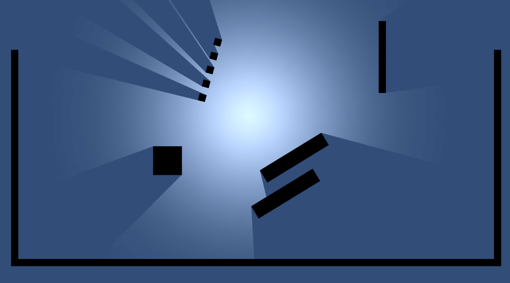

# ■概要
2DのVolumeLight表現を行うUnityプロジェクトのサンプルです。 
詳細は後日頒布予定の別紙(pdfあり)にてご紹介させて頂く予定です。 

■別紙資料 
URL(準備中 pdf版の頒布後に更新します)

■Sample

■Wireframe

■起動方法
1. `Window/Package Manager` から `2D` をインストール
2. 同様に `Universal RP` をインストール
3. Assets/VL2D/Sceans/2DTest.unityを起動

※特に操作等はありませんので動作を眺めるだけです

■Unity version
2021.3.6f1
